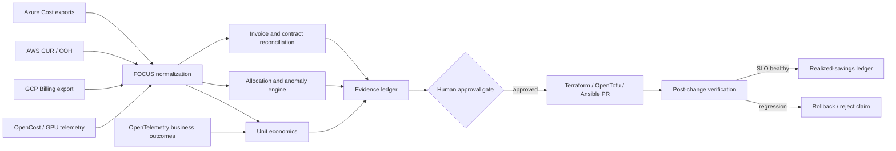

# AI Cloud Cost Optimization Platform

Evidence-backed **FinOps automation** for **Azure Cost Management**, **AWS cost optimization**, **GCP Cloud Billing**, **Kubernetes cost monitoring**, **GPU cost optimization**, invoice reconciliation, chargeback, anomaly detection, and AI unit economics.

This is an Apache-2.0 reference implementation of the financial control loop missing between cloud-provider recommendations, Infrastructure as Code, Finance, and business outcomes. It never calls a cost reduction “realized” until post-change spend is measured and service objectives remain healthy.

> Turn cloud bills into attributable unit economics, reviewable remediation, and verified recovery—not a dashboard of hypothetical savings.

## Working capabilities

- Imports a strict, FOCUS-compatible CSV contract with aliases for common provider columns.
- Reconciles billed prices against effective-dated contracted unit rates.
- Detects per-resource cost anomalies against prior-history medians without contaminating the baseline.
- Calculates cost-center allocation coverage and workload value-to-cost ratios.
- Generates stable finding IDs and a SHA-256 evidence envelope.
- Deduplicates overlapping detector findings so opportunities are not inflated.
- Separates potential recovery from net realized savings.
- Rejects realized-savings claims when an SLO regresses.
- Uses deterministic financial calculations; an LLM may explain evidence but cannot change it.

## Quick start

```bash
python -m venv .venv
. .venv/bin/activate
python -m pip install -e .
cloudcost fixtures/focus-sample.csv --output recovery-report.json
python -m unittest discover -s tests
```

The fixture intentionally contains a contract-rate mismatch, a daily cost anomaly, and unallocated spend so the output is inspectable rather than decorative.

## Architecture



See [the detailed system design](docs/architecture.md), [data contract](docs/data-contract.md), [threat model](docs/threat-model.md), and [commercial validation plan](docs/validation-plan.md).

## KPIs

| KPI | Definition | Initial target |
|---|---|---:|
| Reconciliation coverage | Spend evaluated / imported spend | ≥ 95% |
| Allocation coverage | Attributed effective cost / total effective cost | ≥ 95% |
| Chargeback accuracy | Correct allocations / sampled allocations | ≥ 99% |
| Anomaly precision | Actionable alerts / reviewed alerts | ≥ 80% |
| Mean time to detect | Charge ingestion to finding | < 15 min streaming; < 24 h batch |
| Verified recovery rate | Net realized savings / addressable spend | Measured, never assumed |
| Forecast error | Absolute forecast variance / actual | < 10% |
| Change acceptance | Approved proposals / reviewed proposals | Tracked by risk band |
| SLO regression rate | Changes causing SLO regression / executed changes | < 1% |
| Cost per accepted AI outcome | Effective AI cost / accepted outcomes | Workload-specific |

## OSS and proprietary positioning

| Category | Strength | Boundary addressed here |
|---|---|---|
| Azure/AWS/GCP native tools | Authoritative provider recommendations | Cross-provider normalization and independent verification |
| OpenCost/Kubecost | Kubernetes allocation | Invoice, contract, GL, business-value and recovery workflow |
| Infracost | Pre-deployment IaC estimation | Actual bill reconciliation and post-change proof |
| Enterprise FinOps suites | Broad reporting and commercial support | Transparent calculations and portable evidence |
| Spreadsheets | Flexible and familiar | Repeatability, controls, lineage and automation |

## Safety and credibility boundaries

- Read-only ingestion is the default.
- No autonomous commitment purchases or resource deletion.
- Mixed currencies fail closed until an explicit FX policy is applied.
- Recommendations must state expected savings, confidence, owner, blast radius, rollback and validation window.
- Synthetic fixtures prove software behavior, not customer savings.
- Provider exports can contain identifiers; sanitize them before sharing evidence publicly.

## Distribution

The OSS wedge is a free local assessment and evidence report. A commercial deployment can add managed connectors, SSO/RBAC, a durable ledger, ERP integrations, support, and verified-savings operations. MSPs can package it as a tenant-isolated assessment rather than granting a third party write access to customer estates.

For architecture, FinOps engineering, cloud optimization, or managed implementation: [A2Z SOC](https://a2zsoc.com/).

## License

Apache License 2.0. “FOCUS” refers to the FinOps Open Cost and Usage Specification; this project is not presented as a certification or endorsement.
